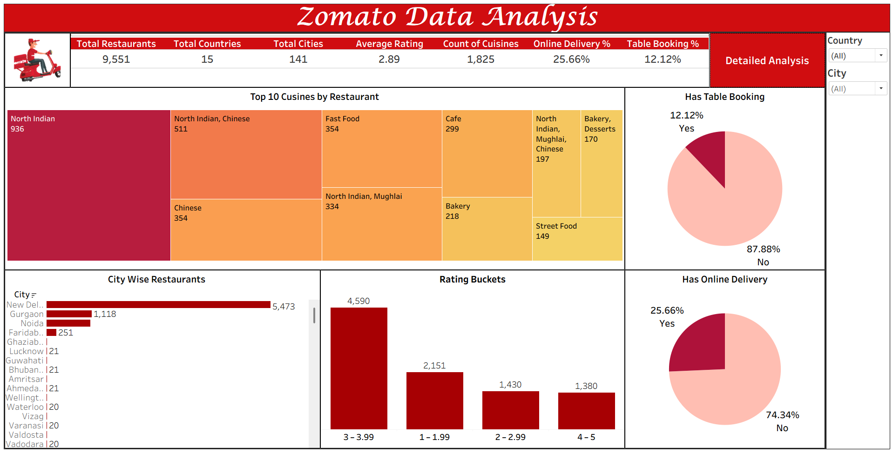

# Zomato-Analytics
End-to-end Zomato data analysis project built using Excel, Power BI, and Tableau to generate interactive dashboards and business insights.

## 📊 Dashboard Preview

## 🔎 Analysis Performed
- Restaurant distribution by City & Country
- Rating Bucket Analysis (1–2, 2–3, 3–4, 4–5)
- Restaurant Count by Price Range
- Top 10 Cuisines by Restaurant Count
- Online Delivery vs Non-Delivery Comparison
- Table Booking Availability Analysis
- Restaurant Opening Trends by Year

## 💡 Key Insights
- Majority of restaurants fall in the 3–4 rating range.
- Online delivery availability is approximately 25%.
- Only around 12% of restaurants provide table booking.
- North Indian cuisine has the highest presence.
- Restaurant openings show consistent yearly growth.
